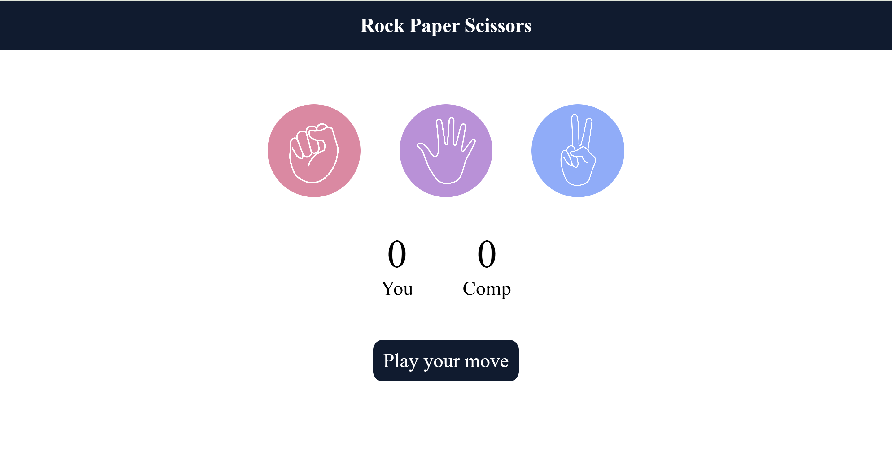

# Stone Paper Scissors Game 🎮

A simple **Stone, Paper, Scissors** game built using **HTML**, **CSS**, and **JavaScript**. Play the classic game against the computer and see if you can win!

## Features

- **Play Against the Computer**: Challenge the AI and see if you can win.
- **Simple & Clean UI**: Easy-to-use and responsive interface for a fun gaming experience.
- **Real-time Score**: Displays your score and the computer's score during the game.
- **Game Reset**: Restart the game with a click of a button.

## Technologies Used

- **HTML**: Structure the game layout and elements.
- **CSS**: Styling the interface with clean, responsive design.
- **JavaScript**: Handles game logic, user interactions, and decision-making for the computer.

## How to Play

1. Choose **Stone**, **Paper**, or **Scissors** to play.
2. The computer will randomly pick one of the three options.
3. The winner is determined based on the classic rules:
   - Stone beats Scissors
   - Scissors beats Paper
   - Paper beats Stone
4. The game will show your score and the computer's score.
5. You can reset the game at any time.

## Getting Started

### Prerequisites

- A web browser (Chrome, Firefox, etc.).

### Installation

1. Clone the repository:
   ```bash
   git clone https://github.com/Nagaraj-Jadar/StonePaperScissor.git
2. Open the index.html file in your browser to start playing.


### Explanation:
1. **Demo Section**:  
   - In the section `## Demo`, I've added the following line to display the GIF:
     ```markdown
     
     ```
     This will display the `game-demo.gif` from the `images/` folder in your project.

2. **License Section**:  
   - Under the `## License` section, it mentions that this project is licensed under the **MIT License**:
     ```markdown
     This project is licensed under the MIT License.
     ```

### Steps for You to Follow:
1. **Place your GIF or image** in a folder within your project (e.g., `images/`). For example, your project folder structure could look like this:

